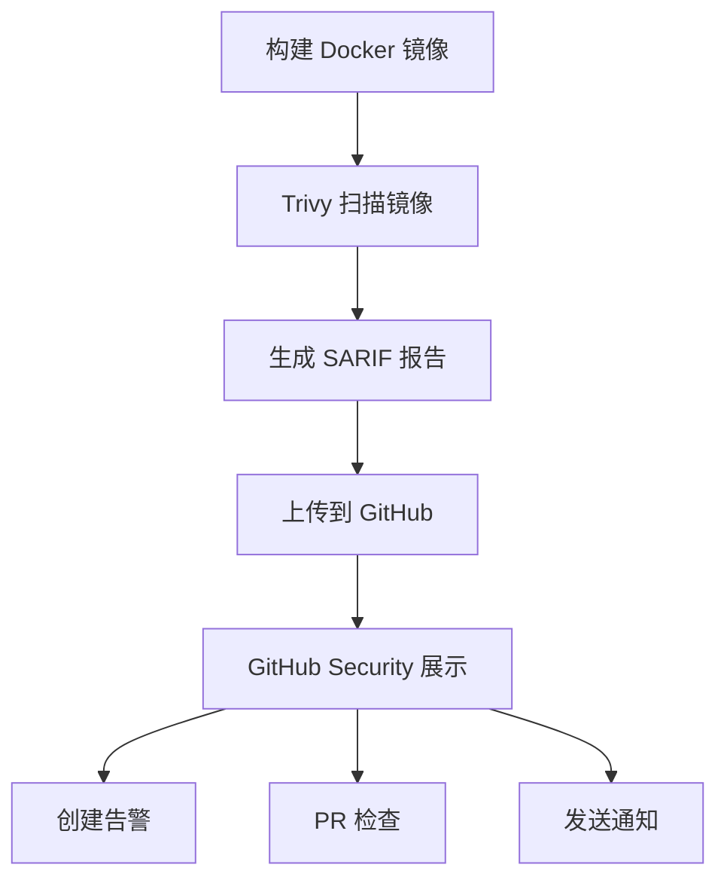

# CI 安全扫描详解

## 概述

本文档详细说明 CI/CD 流程中的安全扫描机制,特别是 Trivy 扫描和结果上传的作用。

---

## 🔍 Trivy 安全扫描

### 什么是 Trivy?

**Trivy** 是 Aqua Security 开发的开源漏洞扫描器,用于检测:

1. **容器镜像漏洞**
   - 操作系统包漏洞 (Alpine, Ubuntu, Debian, etc.)
   - 应用依赖漏洞 (Python, Node.js, Go, etc.)

2. **严重程度分级**
   - 🔴 **CRITICAL**: 严重漏洞,需立即修复
   - 🟠 **HIGH**: 高危漏洞,尽快修复
   - 🟡 **MEDIUM**: 中危漏洞,计划修复
   - 🟢 **LOW**: 低危漏洞,可选修复

3. **CVE 数据库**
   - 实时更新的漏洞数据库
   - 包含 100,000+ 已知漏洞

### 在我们项目中的配置

```yaml
- name: 扫描镜像安全
  uses: aquasecurity/trivy-action@master
  with:
    image-ref: 'lark-service:${{ github.sha }}'  # 扫描的镜像
    format: 'sarif'                                # 输出格式
    output: 'trivy-results.sarif'                  # 输出文件
```

**扫描内容**:
- Python 依赖 (从 `requirements.txt`)
- 操作系统包 (基础镜像)
- 应用配置问题

---

## 📤 上传 Trivy 结果

### 作用

```yaml
- name: 上传 Trivy 结果
  uses: github/codeql-action/upload-sarif@v3
  if: always()                              # 即使扫描失败也上传
  with:
    sarif_file: 'trivy-results.sarif'       # 扫描结果文件
```

**核心作用**:将 Trivy 扫描结果上传到 **GitHub Security** 标签页

### 1. GitHub Security 集成

上传后,扫描结果会显示在:

```
你的仓库 → Security 标签 → Code scanning alerts
```

**界面展示**:
```
Security
├── Code scanning
│   ├── 🔴 Critical: 2 alerts
│   ├── 🟠 High: 5 alerts
│   ├── 🟡 Medium: 10 alerts
│   └── 🟢 Low: 3 alerts
└── Dependabot alerts
```

### 2. 自动化漏洞管理

**GitHub 会自动**:

✅ **创建 Alert (告警)**
```
每个漏洞都会创建一个独立的告警
包含:
- 漏洞描述
- 严重程度
- 受影响的文件
- 修复建议
- CVE 链接
```

✅ **Pull Request 检查**
```
在 PR 中显示新引入的漏洞
防止将有漏洞的代码合并到主分支
```

✅ **通知**
```
发送邮件/通知给仓库管理员
关键漏洞会优先通知
```

✅ **趋势分析**
```
显示漏洞数量随时间的变化
帮助评估安全改进效果
```

### 3. SARIF 格式

**SARIF** = Static Analysis Results Interchange Format

**为什么用 SARIF?**
- 📋 **标准化**: 行业标准格式
- 🔄 **互操作性**: 多种工具支持
- 📊 **结构化**: 易于解析和展示
- 🎯 **精确定位**: 包含文件位置、代码行号

**SARIF 示例**:
```json
{
  "version": "2.1.0",
  "runs": [{
    "tool": {
      "driver": {
        "name": "Trivy",
        "version": "0.50.0"
      }
    },
    "results": [{
      "ruleId": "CVE-2024-1234",
      "level": "error",
      "message": {
        "text": "Critical vulnerability in package XYZ"
      },
      "locations": [{
        "physicalLocation": {
          "artifactLocation": {
            "uri": "requirements.txt"
          },
          "region": {
            "startLine": 10
          }
        }
      }]
    }]
  }]
}
```

---

## 🔄 完整工作流程

### 步骤详解



### 实际执行

**1. 构建阶段**
```bash
docker build -t lark-service:abc123 .
```

**2. Trivy 扫描**
```bash
trivy image --format sarif --output trivy-results.sarif lark-service:abc123
```

**输出示例**:
```
2024-01-15T12:00:00.000Z  INFO  Vulnerability scanning is enabled
2024-01-15T12:00:05.000Z  INFO  Detected OS: alpine 3.19
2024-01-15T12:00:10.000Z  INFO  Number of PL detected: 1
2024-01-15T12:00:15.000Z  INFO  Detected vulnerabilities: 15
```

**3. 上传结果**
```bash
# GitHub Action 自动执行
gh api repos/:owner/:repo/code-scanning/sarifs \
  --input trivy-results.sarif
```

**4. GitHub 处理**
- 解析 SARIF 文件
- 创建/更新告警
- 与历史记录对比
- 标记新增/修复的漏洞

---

## 📊 实际效果

### Security 标签页展示

**示例告警**:

```
🔴 CRITICAL: Arbitrary Code Execution in cryptography

Package: cryptography
Version: 41.0.0
Fixed in: 41.0.7
CVE: CVE-2024-1234

Description:
A vulnerability in the cryptography package allows 
arbitrary code execution when processing malformed input.

Affected Files:
- requirements.txt:15

Recommendation:
Upgrade to version 41.0.7 or later

References:
- https://nvd.nist.gov/vuln/detail/CVE-2024-1234
- https://github.com/pyca/cryptography/security/advisories/GHSA-xxxx
```

### Pull Request 检查

当你创建 PR 时:

```
✅ Code scanning — No new alerts
   or
❌ Code scanning — 3 new alerts found
   🔴 1 Critical
   🟠 2 High
   
   View details → 
```

**点击查看详情**:
```
New alerts in this pull request:

1. 🔴 SQL Injection vulnerability
   File: src/lark_service/core/storage.py:123
   Recommendation: Use parameterized queries
   
2. 🟠 Insecure deserialization
   File: src/lark_service/utils/cache.py:45
   Recommendation: Validate input before deserializing
```

---

## 💡 为什么这很重要?

### 1. 早期发现安全问题

**传统方式**:
```
开发 → 部署 → 生产环境被攻击 → 应急修复 → 损失惨重
```

**使用 Trivy**:
```
开发 → CI 扫描 → 发现漏洞 → 修复 → 安全部署 → 防患于未然
```

### 2. 合规要求

许多行业标准要求:
- 🏦 **金融行业**: PCI DSS
- 🏥 **医疗行业**: HIPAA
- 🇪🇺 **欧盟**: GDPR
- 🔐 **安全认证**: SOC 2, ISO 27001

都要求:
- ✅ 定期安全扫描
- ✅ 漏洞追踪记录
- ✅ 及时修复高危漏洞

### 3. 供应链安全

**现代应用依赖复杂**:
```
你的项目
├── 直接依赖: 20个包
│   └── 间接依赖: 200个包
└── 基础镜像依赖: 100个包
总计: 320+ 个依赖包
```

**任何一个包的漏洞都可能影响你的应用!**

Trivy 帮你监控:
- ✅ 所有依赖的安全状态
- ✅ 新发现的漏洞 (实时更新)
- ✅ 可用的修复版本

---

## 🛠️ 配置最佳实践

### 1. 忽略已知的误报

创建 `.trivyignore` 文件:

```bash
# 忽略特定 CVE (经过评估,不影响我们的使用场景)
CVE-2024-1234

# 忽略测试依赖的低危漏洞
CVE-2024-5678 # 仅用于开发环境

# 临时忽略 (计划在下个版本修复)
CVE-2024-9999 # TODO: 升级 package-xyz 到 v2.0
```

### 2. 设置严重度阈值

只阻止高危和严重漏洞:

```yaml
- name: 扫描镜像安全
  uses: aquasecurity/trivy-action@master
  with:
    image-ref: 'lark-service:${{ github.sha }}'
    format: 'sarif'
    output: 'trivy-results.sarif'
    severity: 'CRITICAL,HIGH'  # 只报告高危和严重漏洞
    exit-code: '1'             # 发现漏洞时失败 (可选)
```

### 3. 定期扫描已部署的镜像

不仅在 CI 中扫描,还应该:

```yaml
# 定时任务
on:
  schedule:
    - cron: '0 0 * * 0'  # 每周日扫描一次

jobs:
  scan-deployed:
    runs-on: ubuntu-latest
    steps:
      - name: 扫描生产镜像
        uses: aquasecurity/trivy-action@master
        with:
          image-ref: 'your-registry/lark-service:latest'
          format: 'sarif'
          output: 'trivy-results.sarif'
```

---

## 📈 监控和改进

### 查看安全趋势

1. **进入 Security 标签**
   ```
   GitHub 仓库 → Security → Code scanning
   ```

2. **查看趋势图表**
   ```
   显示:
   - 过去 3 个月的漏洞数量变化
   - 修复速度
   - 新引入的漏洞
   ```

3. **按严重度过滤**
   ```
   只看 Critical 漏洞
   只看特定 CVE
   只看未修复的问题
   ```

### 设置修复目标

**示例工作流**:
```
1. 立即修复: Critical 漏洞 (24小时内)
2. 优先修复: High 漏洞 (1周内)
3. 计划修复: Medium 漏洞 (1个月内)
4. 可选修复: Low 漏洞 (有空时)
```

---

## 🔗 相关资源

### 文档
- [Trivy 官方文档](https://trivy.dev/)
- [GitHub Code Scanning](https://docs.github.com/en/code-security/code-scanning)
- [SARIF 规范](https://sarifweb.azurewebsites.net/)

### 我们项目中的相关配置
- [CI/CD 配置](../.github/workflows/ci.yml)
- [Docker 构建](../Dockerfile)
- [依赖管理](../requirements.txt)

---

## 📝 总结

### "上传 Trivy 结果" 的核心价值

| 功能 | 价值 |
|------|------|
| **集中化管理** | 所有安全问题在一个地方查看 |
| **自动化告警** | 不需要手动检查扫描结果 |
| **历史追踪** | 查看安全状况随时间的变化 |
| **PR 集成** | 防止引入新的安全问题 |
| **团队协作** | 分配、讨论、跟踪修复进度 |
| **合规性** | 满足安全审计要求 |

### 一句话总结

**"上传 Trivy 结果"** 将容器镜像的安全扫描结果自动上传到 GitHub Security 标签页,实现了安全漏洞的**自动化发现、追踪、管理和修复**,是现代 DevSecOps 的核心实践。

---

**更新时间**: 2026-01-15  
**维护者**: DevOps Team
