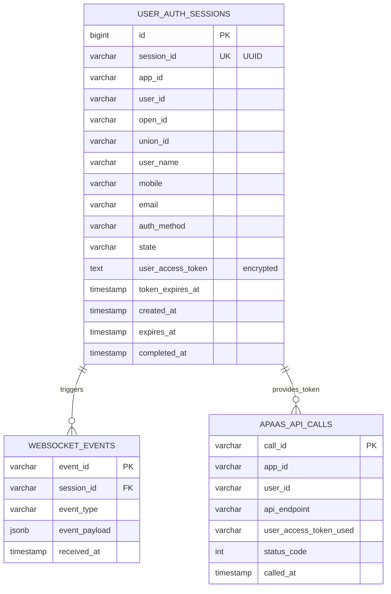

# Data Model: WebSocket 用户授权方案

**Feature**: 002-websocket-user-auth
**Created**: 2026-01-19
**Status**: Design Complete

---

## 📊 Entity-Relationship Diagram (ERD)



---

## 📋 Entity Definitions

### 1. UserAuthSession (用户授权会话)

**Purpose**: 管理用户授权会话的完整生命周期,存储 user_access_token 和用户信息

**Table Name**: `user_auth_sessions` (已存在,需扩展)

**Storage**: PostgreSQL (生产) / SQLite (开发/测试)

#### Fields

| Field | Type | Nullable | Default | Description |
|-------|------|----------|---------|-------------|
| `id` | BIGINT | NO | AUTO | 主键,自增 ID |
| `session_id` | VARCHAR(64) | NO | UUID | 会话唯一标识符 |
| `app_id` | VARCHAR(64) | NO | - | 飞书应用 ID |
| `user_id` | VARCHAR(64) | NO | - | 飞书用户 ID |
| `open_id` | VARCHAR(64) | YES | NULL | 用户 OpenID (授权完成后填充) |
| `union_id` | VARCHAR(64) | YES | NULL | 用户 UnionID (跨应用唯一) |
| `user_name` | VARCHAR(128) | YES | NULL | 用户姓名 |
| `mobile` | VARCHAR(32) | YES | NULL | 手机号 (加密存储) |
| `email` | VARCHAR(128) | YES | NULL | 邮箱地址 |
| `auth_method` | VARCHAR(32) | NO | 'websocket_card' | 认证方式 (websocket_card/oauth/http_callback) |
| `state` | VARCHAR(16) | NO | 'pending' | 会话状态 (pending/completed/expired) |
| `user_access_token` | TEXT | YES | NULL | 用户访问 Token (pg_crypto 加密) |
| `token_expires_at` | TIMESTAMP | YES | NULL | Token 过期时间 (UTC) |
| `created_at` | TIMESTAMP | NO | NOW() | 会话创建时间 (UTC) |
| `expires_at` | TIMESTAMP | NO | NOW()+10min | 会话过期时间 (默认 10 分钟) |
| `completed_at` | TIMESTAMP | YES | NULL | 会话完成时间 (UTC) |

#### Indexes

```sql
-- Primary Key
CREATE UNIQUE INDEX idx_user_auth_sessions_pk ON user_auth_sessions(id);

-- Unique Constraint
CREATE UNIQUE INDEX idx_user_auth_sessions_session_id ON user_auth_sessions(session_id);

-- Query Optimization
CREATE INDEX idx_user_auth_sessions_user ON user_auth_sessions(app_id, user_id);
CREATE INDEX idx_user_auth_sessions_state ON user_auth_sessions(state, expires_at);
CREATE INDEX idx_user_auth_sessions_token_expires ON user_auth_sessions(token_expires_at) WHERE token_expires_at IS NOT NULL;
CREATE INDEX idx_user_auth_sessions_created_at ON user_auth_sessions(created_at DESC);
```

#### State Transitions

```
pending → completed   (用户授权成功)
pending → expired     (10分钟内未授权)
completed → expired   (Token 完全过期且无法刷新)
```

#### Encryption

- **Field**: `user_access_token`, `mobile`
- **Method**: PostgreSQL `pg_crypto` extension
- **Algorithm**: AES-256-CBC
- **Key**: 从环境变量 `ENCRYPTION_KEY` 加载

**Encryption Example**:
```sql
-- Encrypt
UPDATE user_auth_sessions
SET user_access_token = pgp_sym_encrypt('u-xxx', :encryption_key)
WHERE session_id = :session_id;

-- Decrypt
SELECT pgp_sym_decrypt(user_access_token::bytea, :encryption_key)
FROM user_auth_sessions
WHERE session_id = :session_id;
```

---

### 2. WebSocketConnectionStatus (WebSocket 连接状态)

**Purpose**: 跟踪 WebSocket 长连接的状态和健康度

**Type**: Python Dataclass (内存存储,不持久化到数据库)

**File**: `src/lark_service/events/types.py`

#### Fields

```python
@dataclass
class WebSocketConnectionStatus:
    """WebSocket connection status tracking."""

    is_connected: bool                      # 当前连接状态
    last_connected_at: datetime | None      # 最后连接成功时间
    last_disconnected_at: datetime | None   # 最后断开时间
    reconnect_count: int                    # 重连次数 (重置条件: 连接成功)
    last_error: str | None                  # 最后错误信息
    heartbeat_count: int                    # 心跳计数
    last_heartbeat_at: datetime | None      # 最后心跳时间
```

---

### 3. AuthCardOptions (授权卡片配置)

**Purpose**: 自定义授权卡片的展示内容和模板

**Type**: Python Dataclass (传递参数,不持久化)

**File**: `src/lark_service/auth/types.py`

#### Fields

```python
@dataclass
class AuthCardOptions:
    """Options for authorization card customization."""

    include_detailed_description: bool = True  # 是否显示详细说明 (默认 true)
    auth_card_template_id: str | None = None   # 自定义卡片模板 ID (可选)
    custom_message: str | None = None          # 自定义提示消息 (可选)
    privacy_policy_url: str | None = None      # 隐私政策链接 (可选)
```

---

### 4. WebSocketConfig (WebSocket 客户端配置)

**Purpose**: WebSocket 客户端的配置参数

**Type**: Python Dataclass (从环境变量加载)

**File**: `src/lark_service/events/types.py`

#### Fields

```python
@dataclass
class WebSocketConfig:
    """WebSocket client configuration."""

    app_id: str                                   # 飞书应用 ID
    app_secret: str                               # 飞书应用密钥
    max_reconnect_retries: int = 10               # 最大重连次数 (默认 10)
    heartbeat_interval: int = 30                  # 心跳间隔 (秒,默认 30)
    fallback_to_http_callback: bool = True        # 降级到 HTTP 回调 (默认 true)
    reconnect_base_delay: float = 1.0             # 重连基础延迟 (秒,默认 1)
    reconnect_max_delay: float = 60.0             # 重连最大延迟 (秒,默认 60)
```

---

## 🔗 Relationships

### UserAuthSession ↔ WebSocket Events

- **Relationship**: One-to-Many
- **Description**: 一个授权会话可能触发多个 WebSocket 事件 (如多次点击授权按钮)
- **Constraint**: session_id 去重,只处理首次有效授权

### UserAuthSession ↔ aPaaS API Calls

- **Relationship**: One-to-Many
- **Description**: 一个授权会话的 Token 可用于多次 aPaaS API 调用
- **Constraint**: Token 过期后自动刷新或重新授权

---

## 📐 Database Constraints

### Unique Constraints

```sql
-- 会话 ID 全局唯一
ALTER TABLE user_auth_sessions ADD CONSTRAINT uq_user_auth_sessions_session_id UNIQUE (session_id);
```

### Check Constraints

```sql
-- 状态枚举约束
ALTER TABLE user_auth_sessions ADD CONSTRAINT chk_user_auth_sessions_state
CHECK (state IN ('pending', 'completed', 'expired'));

-- 认证方式枚举约束
ALTER TABLE user_auth_sessions ADD CONSTRAINT chk_user_auth_sessions_auth_method
CHECK (auth_method IN ('websocket_card', 'oauth', 'http_callback'));

-- 完成时间逻辑约束
ALTER TABLE user_auth_sessions ADD CONSTRAINT chk_user_auth_sessions_completed_at
CHECK (
    (state = 'completed' AND completed_at IS NOT NULL) OR
    (state != 'completed' AND completed_at IS NULL)
);

-- Token 逻辑约束
ALTER TABLE user_auth_sessions ADD CONSTRAINT chk_user_auth_sessions_token
CHECK (
    (state = 'completed' AND user_access_token IS NOT NULL AND token_expires_at IS NOT NULL) OR
    (state != 'completed')
);
```

### Foreign Key Constraints

无 (UserAuthSession 是独立表,不依赖其他表)

---

## 🔄 Data Migration Strategy

### Migration 1: Extend user_auth_sessions Table

**File**: `migrations/versions/20260119_xxxx_extend_auth_session.py`

**Actions**:
1. Add new columns: `open_id`, `union_id`, `user_name`, `mobile`, `email`
2. Add new indexes: `idx_user_auth_sessions_user`, `idx_user_auth_sessions_token_expires`
3. Update `auth_method` enum to include `websocket_card`
4. Add check constraints for data integrity

**Reversibility**: ✅ Fully reversible (downgrade removes columns and indexes)

**Data Compatibility**: ✅ Existing data unaffected (new columns nullable)

---

## 📊 Sample Data

### Example: Pending Session

```json
{
  "id": 12345,
  "session_id": "550e8400-e29b-41d4-a716-446655440000",
  "app_id": "cli_a1b2c3d4e5f6g7h8",
  "user_id": "ou_7dab8a3d3cdcc08c560abcd",
  "open_id": null,
  "union_id": null,
  "user_name": null,
  "mobile": null,
  "email": null,
  "auth_method": "websocket_card",
  "state": "pending",
  "user_access_token": null,
  "token_expires_at": null,
  "created_at": "2026-01-19T10:00:00Z",
  "expires_at": "2026-01-19T10:10:00Z",
  "completed_at": null
}
```

### Example: Completed Session

```json
{
  "id": 12345,
  "session_id": "550e8400-e29b-41d4-a716-446655440000",
  "app_id": "cli_a1b2c3d4e5f6g7h8",
  "user_id": "ou_7dab8a3d3cdcc08c560abcd",
  "open_id": "ou_7dab8a3d3cdcc08c560abcd",
  "union_id": "on_8e89a9c0d4e5f6a7b8c9d0e1",
  "user_name": "张三",
  "mobile": "+86-13800138000",  // encrypted
  "email": "zhangsan@example.com",
  "auth_method": "websocket_card",
  "state": "completed",
  "user_access_token": "u-7dCz4T...",  // encrypted
  "token_expires_at": "2026-01-26T10:05:00Z",
  "created_at": "2026-01-19T10:00:00Z",
  "expires_at": "2026-01-19T10:10:00Z",
  "completed_at": "2026-01-19T10:05:00Z"
}
```

---

## 🔍 Query Patterns

### Pattern 1: Get Active Token for User

```python
def get_active_token(app_id: str, user_id: str) -> str | None:
    """Get user's active token (most recent, not expired)."""
    session = db.query(UserAuthSession).filter(
        UserAuthSession.app_id == app_id,
        UserAuthSession.user_id == user_id,
        UserAuthSession.state == "completed",
        UserAuthSession.token_expires_at > datetime.now(UTC)
    ).order_by(
        UserAuthSession.completed_at.desc()
    ).first()

    return session.user_access_token if session else None
```

### Pattern 2: Cleanup Expired Sessions

```python
def cleanup_expired_sessions() -> int:
    """Clean up expired pending sessions."""
    count = db.query(UserAuthSession).filter(
        UserAuthSession.state == "pending",
        UserAuthSession.expires_at < datetime.now(UTC)
    ).update({"state": "expired"})

    db.commit()
    return count
```

### Pattern 3: Check Token Expiry

```python
def is_token_expiring(session: UserAuthSession, threshold: float = 0.1) -> bool:
    """Check if token is expiring (< 10% remaining)."""
    if not session.token_expires_at:
        return False

    now = datetime.now(UTC)
    total_duration = (session.token_expires_at - session.completed_at).total_seconds()
    remaining_duration = (session.token_expires_at - now).total_seconds()

    return remaining_duration / total_duration < threshold
```

---

## 🔐 Security Considerations

### 1. Token Encryption

- ✅ All `user_access_token` encrypted at rest using `pg_crypto`
- ✅ Encryption key stored in environment variable, not in code
- ✅ Decryption only when needed for API calls

### 2. PII Protection

- ✅ `mobile` field encrypted
- ✅ `email`, `user_name` stored in plain text (needed for UI display)
- ✅ All logs mask sensitive fields (Token 仅显示前6位+后4位)

### 3. Token Lifecycle

- ✅ Token 过期自动检测 (10% threshold)
- ✅ Token 过期自动刷新 (调用飞书 API)
- ✅ Token 完全过期时自动发送新授权卡片

### 4. Session Security

- ✅ Session ID 使用 UUID v4 (不可预测)
- ✅ Session 10 分钟自动过期 (防止未完成会话堆积)
- ✅ Session 完成后不可重复使用

---

## 📈 Performance Optimization

### 1. Index Strategy

- ✅ Composite index on `(app_id, user_id)` for fast user lookup
- ✅ Index on `(state, expires_at)` for cleanup queries
- ✅ Partial index on `token_expires_at` (only non-null values)

### 2. Query Optimization

- ✅ Use `first()` instead of `all()` when only one result needed
- ✅ Use `order_by(...desc())` to get most recent session
- ✅ Use `WHERE token_expires_at > NOW()` to filter expired tokens

### 3. Connection Pool

- ✅ PostgreSQL connection pool size: 10-20 (based on concurrent users)
- ✅ SQLite for development (single connection)

---

## 🧪 Test Data Fixtures

### Fixture: Valid Session

```python
@pytest.fixture
def valid_auth_session(db_session):
    """Create a valid completed auth session."""
    session = UserAuthSession(
        session_id=str(uuid.uuid4()),
        app_id="cli_test",
        user_id="ou_test_user",
        open_id="ou_test_user",
        union_id="on_test_union",
        user_name="Test User",
        mobile="+86-13800138000",
        email="test@example.com",
        auth_method="websocket_card",
        state="completed",
        user_access_token="u-test-token",
        token_expires_at=datetime.now(UTC) + timedelta(days=7),
        expires_at=datetime.now(UTC) + timedelta(minutes=10),
        completed_at=datetime.now(UTC)
    )
    db_session.add(session)
    db_session.commit()
    return session
```

### Fixture: Expired Session

```python
@pytest.fixture
def expired_auth_session(db_session):
    """Create an expired pending session."""
    session = UserAuthSession(
        session_id=str(uuid.uuid4()),
        app_id="cli_test",
        user_id="ou_test_user",
        auth_method="websocket_card",
        state="pending",
        expires_at=datetime.now(UTC) - timedelta(minutes=5)  # Already expired
    )
    db_session.add(session)
    db_session.commit()
    return session
```

---

## 📚 References

- [SQLAlchemy 2.0 Documentation](https://docs.sqlalchemy.org/en/20/)
- [PostgreSQL pg_crypto Documentation](https://www.postgresql.org/docs/current/pgcrypto.html)
- [Alembic Migration Tool](https://alembic.sqlalchemy.org/)
- [飞书 User Access Token API](https://open.feishu.cn/document/common-capabilities/sso/api/get-user-info)

---

**Data Model Status**: ✅ Design Complete
**Next Step**: Generate API contracts (T002, T003)
